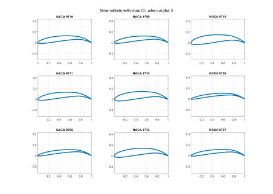

In this project, we explore the different four-digit NACA airfoils. Four-digit NACA airfoil is described by three parameters: while first digit describes the maximum chamber as percentage of the chord, second digit describes of maximum camber the airfoil leading edge in tenths of the chord, and the last two digits describing maximum thickness as percent of the chord. Thus, we change those parameters and find the best NACA airfoil based on maximum CL/CD. Below is the summary.

Prameters:
------
1. Freestream velocity: 20 m/s  (Based upon analysis of fixed wing UAV including Albatross, Slybird and others).
2. Reynolds number: 1.4e6 (for AVL)
3. Viscous mode: On (For AVL)
4. Angle of attack (AoA): 0 degrees (for AVL)

Steps:
------
1. MATLAB script initializes AVL by passing NACA 4-digit airfoil with all possible combinations one by one.
2. AVL runs the analysis for the given NACA 4-digit airfoil in zero angle of attack and saves the airfoil and coefficient of lift and drag in the text file.
2. MATLAB script looks into all saved text files and shorts out the airfoils with the following properties:
  * Maximum coefficient of lift.
  * Maximum coefficient of drag.
  * Maximum ratio of the coefficient of lift to drag.

Results:
------
1. For zero angle of attack airfoil with high camber was observed for the maximum coefficient of lift (CL).
2. For zero angle of attack airfoil with a sphere-like shape yielded a maximum coefficient of drag (CD).

<iframe width="560" height="315" src="https://www.youtube.com/embed/Rs51xVCsnDw" title="YouTube video player" frameborder="0" allow="accelerometer; autoplay; clipboard-write; encrypted-media; gyroscope; picture-in-picture" allowfullscreen></iframe>

 -->

<!-- Headings are cool
======

You can have many headings
====== -->

